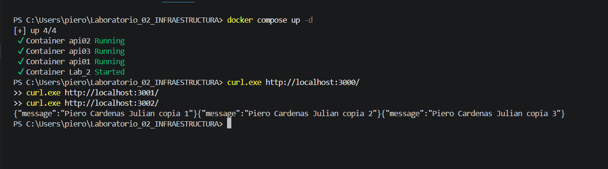

# Laboratorio 02
Hoy utilizaremos docker compose para poder desplegar su trabajo. Servicio web y una
base de datos
## Stack
API
- Minimal API
- Debe retornar un mensaje incluyendo mi nombre
- Lista Dockers
- -  docker run -d --rm -p 3000:3000 nmatsui/hello-world-api. 44035c3c38c8  - vigorous_banach
- - docker run -d --rm -p 3001:3000 nmatsui/hello-world-api. e43f29cf57b3 - distracted_wilbur
- - docker run -d --rm -p 3002:3000 nmatsui/hello-world-api. 907bc961e055 - determined_jeps
BD
- PostgreSQL
- $ docker run --name Lab_2 -e POSTGRES_PASSWORD=123 -d postgres  
- Volumenes
- db_data:/var/lib/postgresql/data
- db_data - nombre de volumen 
- /var/lib/postgresql/data - ruta dentro del contenedor de Postgres
# Tipos de Redes  en Docker
- Bridge (default): red virtual aislada en el host. Los contenedores dentro de la misma bridge se comunican entre sí libremente, y hacia el exterior salen mediante NAT. Es la que se usa cuando no especificas nada al levantar un contenedor.
- Host: el contenedor comparte directamente la pila de red del host, sin aislamiento. No hay NAT ni mapeo de puertos: usa los puertos del host tal cual. Es más rápido en rendimiento de red, pero se pierde el aislamiento.
None: el contenedor no tiene ninguna interfaz de red real, solo loopback. Se usa cuando quieres aislar totalmente un contenedor o manejar la conectividad tú mismo con herramientas externas.
- Overlay: crea una red distribuida que conecta contenedores corriendo en distintos hosts físicos, típico en clústeres de Docker Swarm.
- Macvlan: le asigna a cada contenedor una IP propia dentro de la red física, como si fuera un dispositivo más de la LAN. Útil cuando el contenedor necesita ser visible directamente en la red, sin pasar por NAT.
- IPvlan: similar al macvlan, pero todos los contenedores comparten la misma MAC address del host y solo varía la IP. Da más control sobre el esquema de direccionamiento.
# Tipo de Volumenes en Docker
- Volumes: gestionados completamente por Docker, se almacenan en /var/lib/docker/volumes/ dentro del host. Es la forma recomendada de persistir datos porque Docker maneja backups, migración y permisos, y funciona bien tanto en Linux como en Windows.
- Bind mounts: montan una carpeta o archivo específico del host, usando su ruta exacta, directamente dentro del contenedor. Dan mayor control sobre la ubicación de los datos, pero dependen de la estructura del sistema host, por lo que son menos portables entre entornos.
- tmpfs mounts: se almacenan solo en la memoria RAM del host, nunca en disco. Al detener el contenedor esos datos se pierden. Son útiles para información sensible o temporal que no debe persistir.
-Named vs anonymous volumes: dentro de los volumes gestionados, los named tienen un nombre definido por el usuario, lo que facilita reutilizarlos en otros contenedores; los anonymous se crean automáticamente con un identificador tipo hash, siendo más difíciles de referenciar después.
# Indicaciones
## Comandos
```bash
docker compose up -d
```
## Configuración por entorno
```
MESSAGE=<Piero Cardenas Julian>
```

# Creditos
- Cardenas Julian Juan Piero 
- ID: 000115468
# ETC